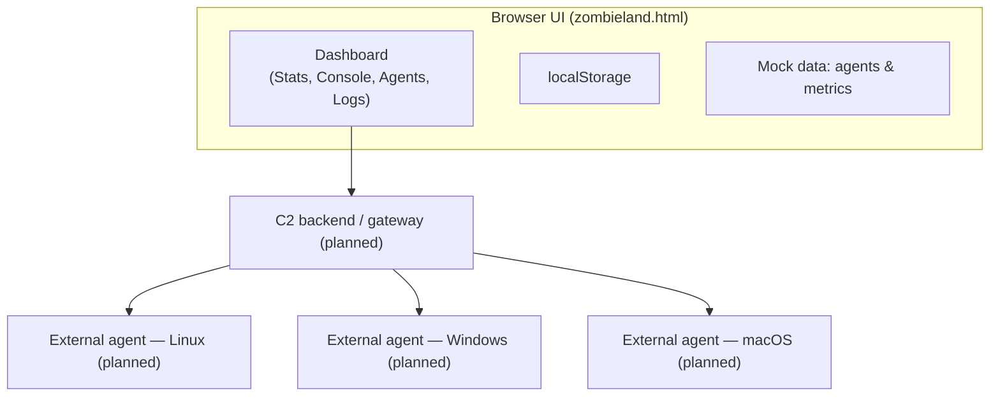

# Zombieland — Modern C2 Dashboard (Frontend Only)

> **Status:** This repository currently contains the **frontend dashboard only** (`zombieland.html`).  
> The **server and agent** components are **under active development** and will be published in future releases.

## Overview
Zombieland is a **modern, responsive, and modular web dashboard** for Command & Control (C2) operations.  
This version ships as a **single HTML file** with self-contained UI logic, demo data (mock agents), and local persistence via `localStorage`.

The goal is to provide an **operator-ready interface** that can later connect to real agents over REST/WebSocket APIs. For now, the UI runs standalone with simulated metrics and mock entities for demonstration.

---

## Dashboard (grid view)

---

## Features

### Agent management (mock)
- Grid/List views with **filters**: OS (Linux / Windows / macOS), status (online / idle / busy / offline), free-text search.
- **Multi-select**, **Select all / Clear**, status-colored borders, OS icons.
- Visual status tint across the whole card; highlight when selected.

### Global console
- Broadcast commands to selected agents (simulated).
- Prompt-style input with **preset-based suggestions** and **Tab completion**.
- TX/RX log stream, smart auto-scroll, **Clear**, **Fullscreen** toggle.

### Presets & Logs
- **Command presets**: add/remove in **Settings**, quick insert via Presets overlay.
- **Session logs** panel with one-click clear.

### Modular, responsive UI
- Panels (Stats, Console, Agents, Logs) arranged by rows and **split** side-by-side per row.
- **Sticky** search/filters header.
- **Compact mode** automatically on narrow widths (e.g., split layouts, mobile).

### Customization
- Configurable server name, role (master/slave for future federation), ports, **app icon URL**.
- **Hacker Mode** (retro neon): glow, scan lines, and halo effects.
- Optional simulated **Live metrics**.

---

## Architecture (current UI & future integrations)

* This repository provides the **Browser/UI** part only.
* The **API** and **Agents** are **in development** and not included here.

---

## Getting Started

### Option 1 — Open directly

1. Clone the repo.
2. Open `zombieland.html` in your browser (double-click).
   No backend required.

### Option 2 — Serve statically (recommended)

Serve the folder with any static HTTP server (e.g., `http-server`, `serve`, Nginx).
Benefits: cleaner paths, controllable caching, predictable CORS when you later wire it to real APIs.

> **CDN dependencies**
>
> * Tailwind CSS (CDN)
> * Lucide icons (UMD via CDN)
>   Keep an internet connection for these assets unless you vendor them locally.

---

## Customization

* **App icon**: set your PNG (preferably transparent) via **Settings → App icon URL**.
  The icon gains a neon **glow** automatically when **Hacker Mode** is enabled.
* **Hacker Mode**: enables retro/scanline/halo effects.
* **Presets**: create reusable commands in **Settings**, then insert them from the **Presets** overlay.
* **Layout**: use the **Columns** button on a panel header to split/unsplit within a row; use arrows to move the row up/down.

---

## Roadmap

* Publish **backend (API)** and **cross-platform agents** (Linux/Windows/macOS).
* Expand built-in command presets (categorization, variables).
* Import/Export for presets and layouts.
* RBAC and multi-user features.

> **Server + Agent:** actively in development. This README will be updated when they are released.

---

## Troubleshooting

* **UI doesn’t load properly**
  Ensure network access to the CDNs (Tailwind, Lucide).
* **Icons not rendering**
  Confirm the Lucide UMD version and icon names.
* **Split/layout behavior**
  Splits are **per row**; use “Split with…” to pair panels side-by-side.
* **Hacker Mode icon glow missing**
  Make sure a valid icon URL is configured and **Hacker Mode** is enabled.

---

## Security & Ethics

Zombieland is provided for **educational and research purposes**.
Do not use it on systems or networks without explicit authorization.
The authors disclaim any liability for misuse.

---

## License

MIT — see `LICENSE`.

